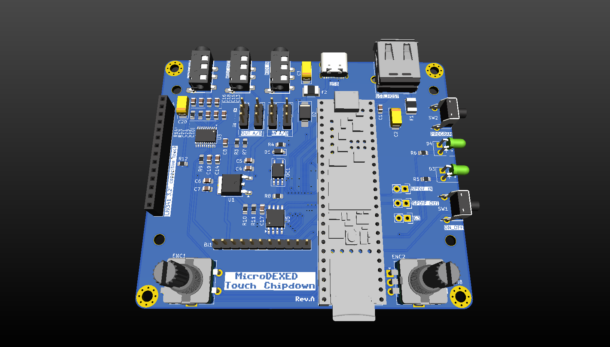
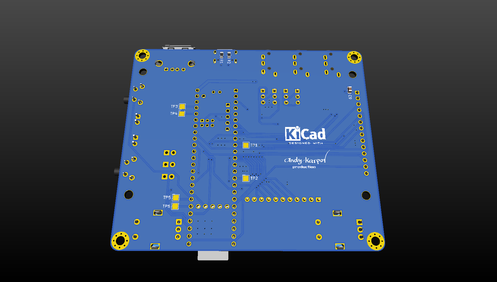

# MicroDEXED Touch Chipdown custom edition

This is an attempt to create a custom PCB of the MicroDEXED Touch (MDT) project to satisfy my own requirements:

- No modules, all chips should be soldered on PCB
- Avoid THT components as much as possible

**Warning! Work in progress. The revA is untested and unreleased yet.**

## Rev.A Renders

