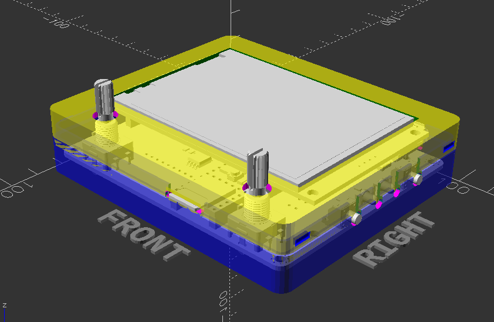
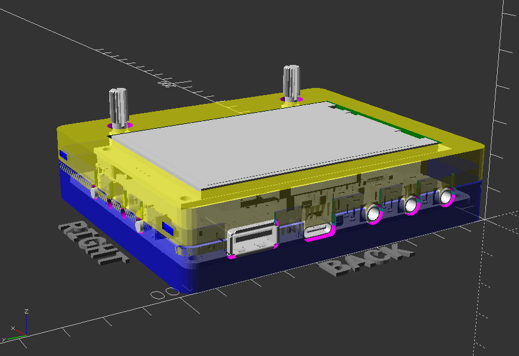
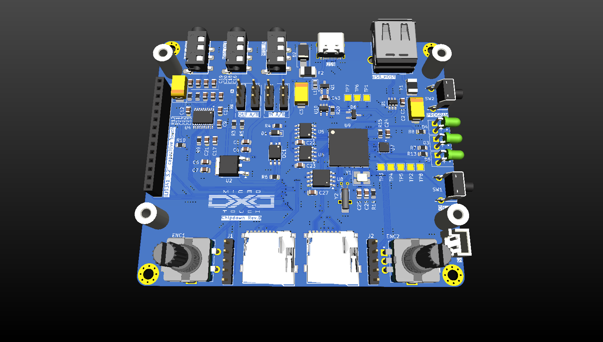
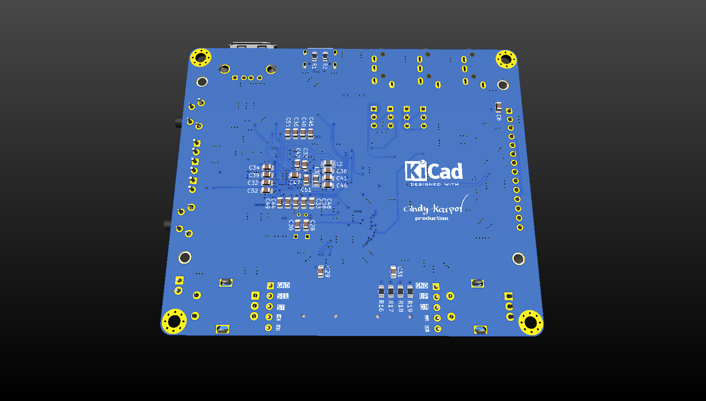

# MicroDEXED Touch Chipdown custom edition

This is an attempt to create a custom PCB of the MicroDEXED Touch (MDT) project to satisfy my own requirements:

- No modules, all chips should be soldered on PCB
- Avoid THT components as much as possible

**Warning! Work in progress. The revB is untested and unreleased yet.**

- Current tested revision: **revA**
- Current dev revision: **revB**

## PCB changelog & ERRATA:

- revA - initial revision
- revB:
    - 4-layers PCB
    - Replaced teensy module with a set of chips
    - Added additional SD card
    - Added additional LED from the supplementary MCU
    - Changed USB Host power path

## Rev.A Renders

## Case for rev.A

## Rev.B Renders

